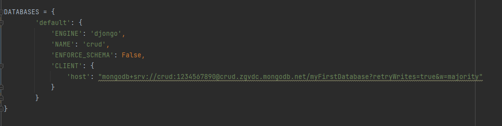
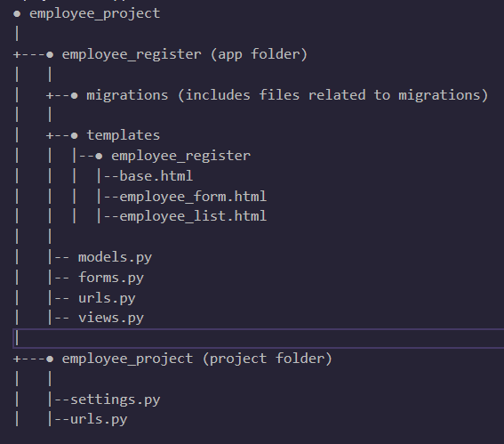

# Complete Django CRUD Webapp with MongoDB Atlas
This is a Complete Django CRUD Webapp with MongoDB Atlas. I made this project to take participate in MongoDB Atlas hackathon in dev.to

I made this using:
 - Django
 - Design Django Form with Bootstrap and crispy forms
 - MongoDB Atlas for backend

The complete backend is made by django and for database I used MongoDB Atlas.
There are many collection but, auth_user, employee_register_employee and employee_postion_employee are the main collection.

To connect django with MongoDB Atlas I used djongo library and pymongo made for python to connect with MongoDB.




This is how the web app looks like

**DEMO VIDEO:**


**REGISTER PAGE:**


**EMPLOYEE LIST PAGE:**


## Get the Code

## How you will see this project

#### **STEP 1:**

Fork this repo and clone it using:
```
git clone https://github.com/shubham8268/Django-CRUD-Operations
cd Django-CRUD-Operations

```
<br>
The Django skeleton is look like this:
<br>



<br>


#### **STEP 2:**
Install virtualenv then create a virtual environment test:
```
pip3 install virtualenv
virtualenv test
source test/bin/activate
```

Install all the dependencies using:
```
pip3 install -r requirements.txt
cd employee_project

```
#### **STEP 3:**
Now you can see the website in your localhost:8000 using:
``` 
python3 manange.py runserver
```
## Additional Resources / Info

This was my first time using MongDB as the database for a website which was a really great experience of using noSQL specially MongoDB Atlas, I'm also planning to use it in my future projects.
I learned about [pymongo package](https://pymongo.readthedocs.io/en/stable/) and [djongo](https://www.djongomapper.com/) availabe for python. I took help from [How to Use Django with MongoDB](https://www.mongodb.com/compatibility/mongodb-and-django) document.